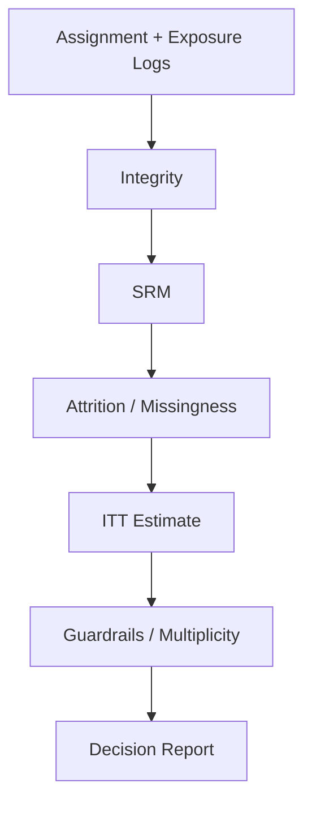
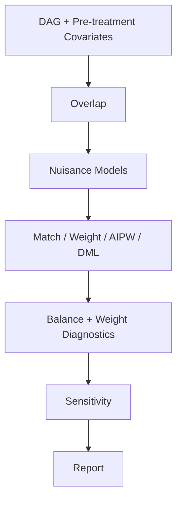
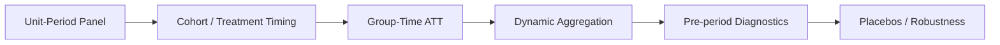

# CausalImpact Diagrams

## Design-to-report flow

```mermaid
flowchart LR
  Q[Research Question] --> D[Study Design]
  D --> G[Causal DAG]
  G --> E[Estimand]
  E --> I[Identification]
  I --> M[Estimator]
  M --> X[Diagnostics]
  X --> S[Sensitivity]
  S --> R[Report]
```

## Experiment trust gate

```mermaid
flowchart TD
  A[Assignment + Exposure Logs] --> I[Integrity]
  I --> SRM[SRM]
  SRM --> MIS[Attrition / Missingness]
  MIS --> EST[ITT Estimate]
  EST --> GUARD[Guardrails / Multiplicity]
  GUARD --> REP[Decision Report]
```

## Observational inference

```mermaid
flowchart TD
  DAG[DAG + Pre-treatment Covariates] --> OV[Overlap]
  OV --> N[Nuisance Models]
  N --> ADJ[Match / Weight / AIPW / DML]
  ADJ --> BAL[Balance + Weight Diagnostics]
  BAL --> SEN[Sensitivity]
  SEN --> REP[Report]
```

## Staggered DiD

```mermaid
flowchart LR
  P[Unit-Period Panel] --> C[Cohort / Treatment Timing]
  C --> GT[Group-Time ATT]
  GT --> DY[Dynamic Aggregation]
  DY --> PRE[Pre-period Diagnostics]
  PRE --> PL[Placebos / Robustness]
```
